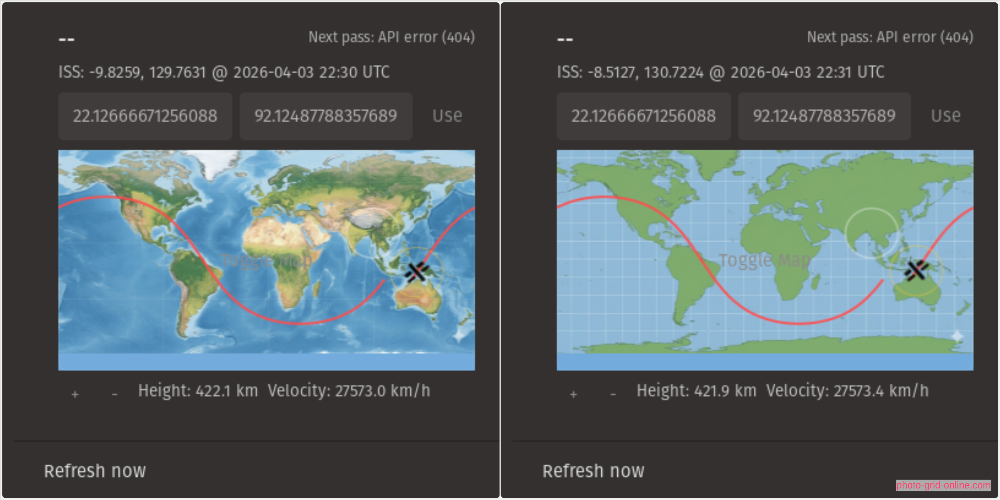

# ISS Detector GNOME Extension

Track the International Space Station (ISS) directly from the GNOME Shell panel. This extension shows live ISS position, a full‑orbit future ground track, visibility indicators for your location, and pass predictions.

**Features**
- Live ISS position on a world map
- Full‑orbit future trajectory line (1 lap)
- Visibility indicators
- Observer visibility circle (from your location)
- ISS visibility footprint circle
- Line to ISS when it is visible from your location
- Zoom and pan the map (scroll + drag)
- Toggle between `map.png` and `realistic-map.png`
- Manual coordinates (lat/lon) with `Use` button
- Height and velocity display
- Next pass prediction (when API available)

**Controls**
- Zoom: scroll on the map, or use `+` / `-`
- Pan: click‑drag the map
- Map toggle: bottom‑right `Map` button
- Manual location: enter latitude/longitude and press `Use`

## APIs
This extension uses public APIs:
- **Current ISS position + future positions**: `wheretheiss.at`
- **Pass prediction**: `open-notify.org` (`iss-pass.json`, HTTP only)

If you see `Next pass: API error (404)`, the Open‑Notify pass endpoint is unavailable. In that case the extension will still show live position and the orbit path, but not next‑pass times.

## Installation (Local)
1. Clone this repo into your local extensions directory:
   - `git clone <your-repo-url> ~/.local/share/gnome-shell/extensions/iss-detector`
2. Rename the folder to match the extension UUID:
   - `mv ~/.local/share/gnome-shell/extensions/iss-detector ~/.local/share/gnome-shell/extensions/iss-detector@gyiptgyipt.github.io`
3. Restart GNOME Shell:
   - On X11: press `Alt+F2`, type `r`, press Enter
4. Enable it in the **Extensions** app.

## Configuration
Some display tweaks can be adjusted in `extension.js`:
- `MAP_IMAGE_Y_OFFSET_PX`: moves the map image only (negative = up)
- `MAP_Y_OFFSET_PX`: moves trajectories/icons (leave at `0` if you only want image movement)
- `TRAJECTORY_SAMPLE_SEC`: resolution of the orbit path
- `TRAJECTORY_REFRESH_SEC`: how often the path is refreshed

## GNOME Extensions Submission
I’ve submitted this extension to extensions.gnome.org. While it’s under review, you can install locally using the steps above.
<!-- 
## License
MIT (or your preferred license). -->
